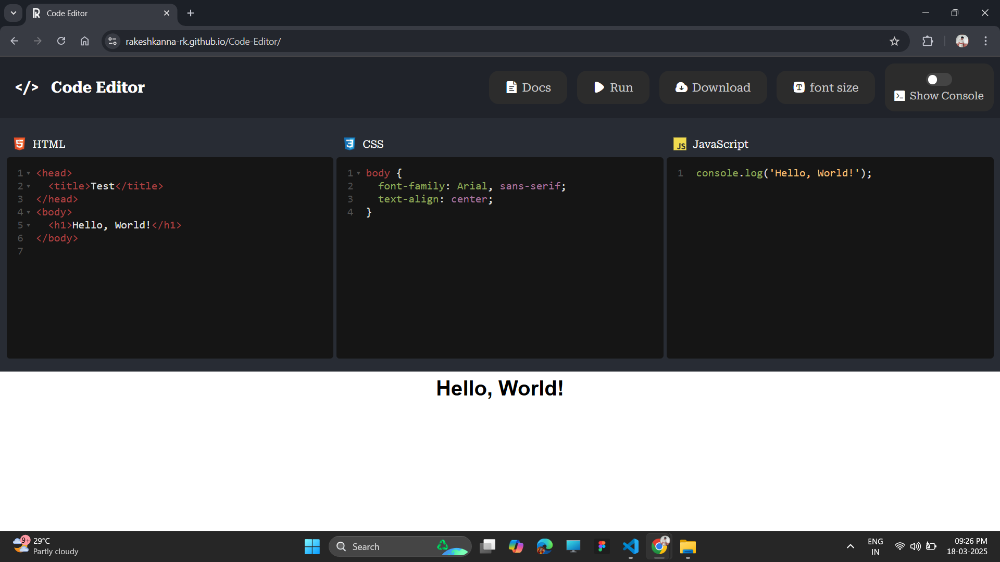
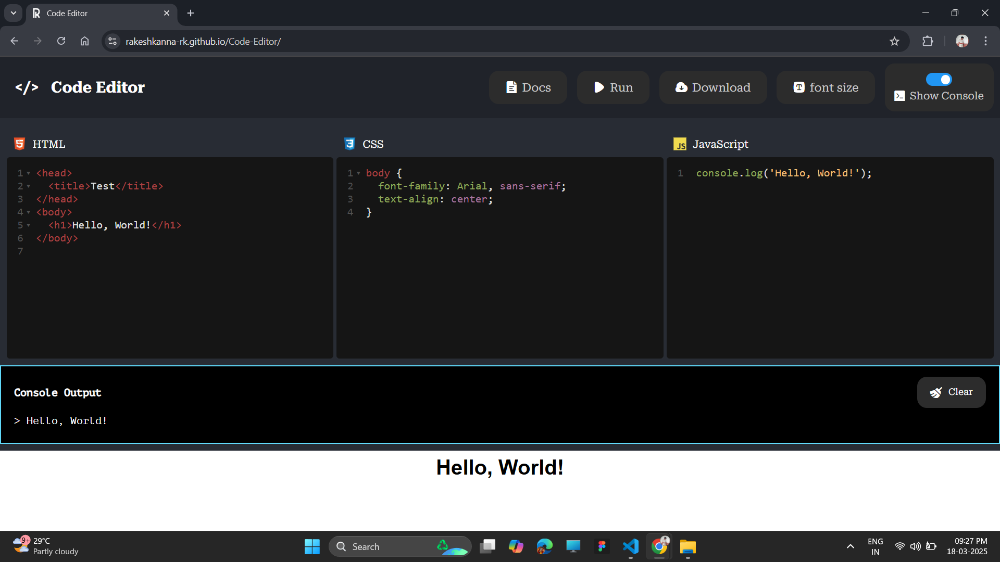

  
# Code Editor

### [OPEN EDITOR](https://rakeshkanna-rk.github.io/Code-Editor/)

This Code Editor is a web-based tool designed for an intuitive coding experience, supporting HTML, CSS, and JavaScript with real-time output rendering.

## Features

- **Multi-Language Support**: Edit HTML, CSS, and JavaScript in separate panels.
- **Syntax Highlighting**: Uses CodeMirror for enhanced readability and an improved coding experience.
- **Console Panel**: View JavaScript console output, warnings, and errors directly within the editor.
- **Download Code**: Save your entire project as a single HTML file with embedded CSS and JavaScript.
- **Collapsible Sections**: Fold/unfold lines for better organization and focus.
- **Auto-closing Tags & Brackets**: Automatically completes tags, brackets, and quotes for faster coding.
- **Font Size Adjuster**: Easily change the editor's font size for better readability.
- **Unsaved Changes Alert**: Prevent accidental navigation loss by warning users about unsaved changes.

## Usage

1. Write your HTML, CSS, and JavaScript in the respective code editor panels.
2. Click the `Run` button to execute and preview your code in real-time.
3. Check the console panel for JavaScript output, warnings, or errors.
4. Use the `Download` button to save your code as a standalone HTML file.
5. Adjust the font size using the settings button to optimize your coding experience.

## Screenshots

**Editor**

**Console**

**Error**

## Contributor Guide

We welcome contributions to improve the Code Editor. To contribute:

1. Fork the repository.
2. Create a new branch: `git checkout -b feature-name`.
3. Implement your changes and commit: `git commit -m 'Add new feature'`.
4. Push to the branch: `git push origin feature-name`.
5. Submit a pull request detailing your changes.

## Credits

This Code Editor was created by [Rakesh Kanna](https://github.com/rakeshkanna-rk). The source code is available on [GitHub](https://github.com/rakeshkanna-rk/Code-Editor).

### PROJECT LICENSED UNDER [MIT LICENSE](LICENSE)

### [OPEN EDITOR](https://rakeshkanna-rk.github.io/Code-Editor/)

