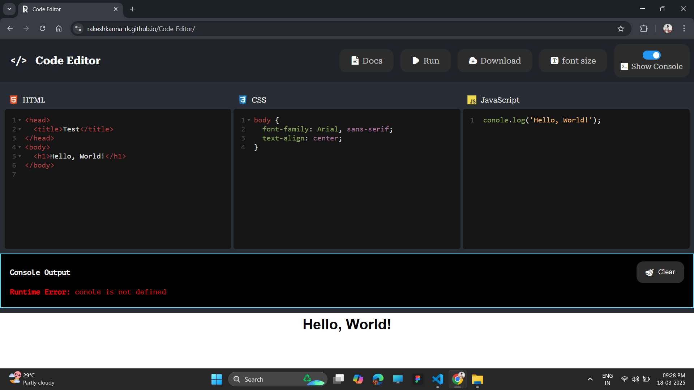

  
# Code Editor

### [OPEN EDITOR](https://rakeshkanna-rk.github.io/Code-Editor/)

This Code Editor is a web-based tool designed for an intuitive coding experience, supporting HTML, CSS, and JavaScript with real-time output rendering.

## Features

- **Multi-Language Support**: Edit HTML, CSS, and JavaScript in separate panels.
- **Real-Time Output**: Instantly preview your code execution within an iframe.
- **Syntax Highlighting**: Uses CodeMirror for better readability and efficient editing.
- **Console Logging**: Displays JavaScript `console.log()` outputs and errors in a built-in console.
- **Download Code**: Save your written code as an HTML file for offline use.
- **Toggle Console**: Show or hide the JavaScript console as needed.

## Usage

1. **Write Code**: Type in the HTML, CSS, and JavaScript panels.
2. **Run Code**: Click the **Run** button to execute and preview the output.
3. **View Console Output**: Toggle the **Show Console** button to view logs and errors.
4. **Download Code**: Click **Download** to save your project as an HTML file.

## Screenshots

**Editor**

**Console**

**Error**

## Contributor Guide

We welcome contributions to improve the Code Editor. To contribute:

1. Fork the repository.
2. Create a new branch: `git checkout -b feature-name`.
3. Implement your changes and commit: `git commit -m 'Add new feature'`.
4. Push to the branch: `git push origin feature-name`.
5. Submit a pull request detailing your changes.

## Credits

This Code Editor was created by [Rakesh Kanna](https://github.com/rakeshkanna-rk). The source code is available on [GitHub](https://github.com/rakeshkanna-rk/Code-Editor).

### PROJECT LICENSED UNDER [MIT LICENSE](LICENSE)

### [OPEN EDITOR](https://rakeshkanna-rk.github.io/Code-Editor/)

